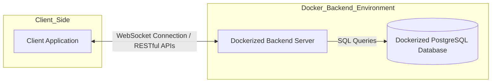
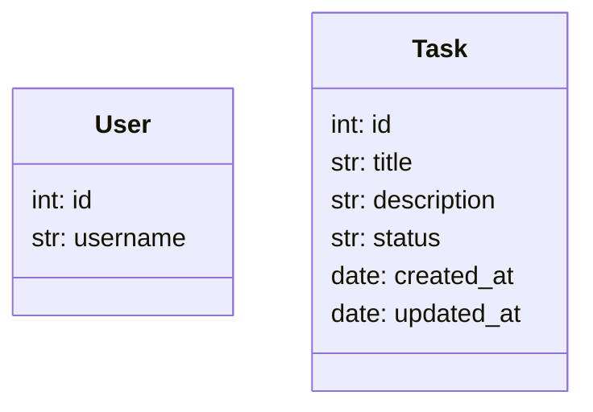

# Task App 
Simple real time task app. Core Features includes:
- User login page with username, persisted to User table
- At the moment all tasks on a connection instance are displayed on the screen
- Real time task creation, edit, and delete following task items:
    - title
    - description
    - status: todo, in progress, done
- Task time created and updated should be captured but at the moment not surfaced in UI
- Updates should be seen for all users on same connection/database instance
- Persisted task board, at the moment all tasks in local database instance
- There's also a series of RESTful APIs for CRUD operations on the Tasks table for any changes directly to backend without real-time requirements as requested in requirements. Docs for those endpoints automatically generated here: [http://localhost:8000/docs#](http://localhost:8000/docs#)


## Running Task Application
### Getting Started Backend
- cd into backend folder
- to run container for backend
```bash

# access backend folder
cd backend

# run and build docker instance with docker compose
docker compose up --build
```
Backend will be running on  [http://localhost:8000](http://localhost:8000) with your browser to see the result.
- to stop container for backend
```bash
docker-compose down --volumes
```

### Getting Started Frontend

- cd into frontend folder
- install packages:

```bash
# access frontend folder
cd frontend


# 
npm install
# or
yarn install
# or
bun install
```

- run the frontend development server:

```bash

npm run dev
# or
yarn dev
# or
bun dev
```


Open [http://localhost:3000](http://localhost:3000) with your browser to see the result.

### Testing
Missing backend tests. Some configuration issues with sqlite that I didnt want to sink my time into.

**Frontend (Vitest)**  
Unit tests for API helpers and Login component.

```bash
cd frontend
yarn install
yarn test          # run once
yarn test:watch    # watch mode
```


## App Architecture and Technology Decisions
### Technology choices
This task app was built with FastApi, WebSockets, React, Vite, ant design component library, and Postgres, with backend containerized via Docker. With assitance from Cursor.
- FastApi was chosen to try out easy to get going Python-based framework. Heard good things and wanted the oportunity to try it out. Also the autodoc for RESTful APIs is nice. Django had a bit much of an overhead for a light app. Briefly thought about trying Supabase but thought it might not showcase enough backend development code.
- React was chosen simply because I was comfortable with it and can get it up and going quickly. Decided against rxjs as it might be overkill. Most of state was maintained in Board.tsx. At most debated moving some state management to react context but app did not require too much prop drilling. Nor did it have any complex state management to think about bringing in anything like Redux or NgRx.
- Vite was also a lightweight easy and fast to get going tooling choice.
- Websockets over Server Sent Events took a bit more deliberation and reading up on. The real-time client componet of the assigmment seemed important so I wanted to ensure eventual two ways, bidirectional, low latency communication for the collaborative aspect of the app. Required more configuration and setup but good oportunity to learn and attempt the manual implementations, etc...

### Architecture

Simple client to containerized backend application architecture with communication protocol layer over websockets real-time collaborative update, create, delete task functionality to the server. RESTful APIs are also used for loging in, creating new users and populate the tasks board at initial render. Backend Server is hooked up to a Postgres relational SQL database. 



### Data Model
Database is Postgres. There's a migration script ``run_migrations`` in services.py. It's run at startup in main.py for convience at the moment. 



At the moment there are no relationships between the User model and the Task model, it should be the case where in the future, there's a foreign key field on Task table linking created_by and updated_by to the respective user and information surfaced on frontend. Also, with more time there should be an additional Workspace Table that handles what Users belong to what workspace and what tickets belong to that workspace. 

### With More Time
- Configure some linting
- Deploy postgres database for a beyond one machine limitation collaboration experience. 
- Add relationship on Task table with User table of columns created_by = foreignkey(User) and updated_by = foreignkey(User) to surface that info. Also surface the created_at and updated_at columns information on the Task item.
- Add a workspace table and hook up relationships so users in a workspace can only see tasks associated with that workspace.
- Add a feature to surface all online users in a common workspace.
- Look into a some refactoring of add_task, edit_task, delete_task websocket endpoint logic to a class perhaps. 
- Backend tests. Did not get SQLite database configuration working for testing backend. Relied more on manual testing. But with more time there's definitely some backend unit testing needed. 
- Add better security best practices. 
- Deploy frontend and backend too. Frontend would also need to be containerized.


## Rough Time Log
- Wednesday evening: 1hr read over requirements and did some rough research on technology. Decided on tradeoffs and roughly decided on certain technology choices. Took a bit longer to learn about some of the frameworks/libraries/etc...Various configuration of computer to set up environment.

- Friday evening: 2hrs started setting up websocket with fastapi, spin up a postgres instance, dockerize, etc...backend things. Ran into a few configs bugs here or there that required some debugging/research. 

- Saturday: 3hrs various times during the morning and evening. Added frontend components. Test frontend functionality with backend. Debugg a few more issues. Spent some bit of time on design, that's a bit extra but that's ok. Some hiccups here or there with a frontend bug but that got smoothed out and fixed. 

- Saturday: 30 min writing the README.md, double checking requirements. 

- I spent twice the recommended time on the project but I wanted the chance to try out some new technologies, learn some stuff, and have fun with the project. 

